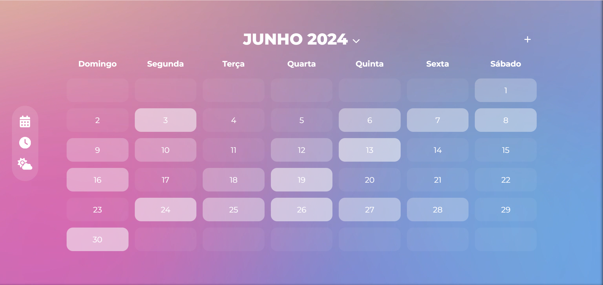

# Calendário/Agenda 📆

## Introdução 

Este projeto apresenta um calendário, inicialmente simples, fixo do mês de junho de 2024, desenvolvido com HTML e CSS. O objetivo inicial é a criação de um calendário funcional, que será aprimorado gradativamente com a adição de novas funcionalidades e interatividade.

## Funcionalidades Futuras

- [ ] Alteração automática para a dia, mês e ano atual;
- [ ] Navegação entre diferentes meses e anos;
- [ ] Adição de compromissos/eventos em datas específicas;
- [ ] Visualização de todos os eventos em uma data específica;
- [ ] Mudança automática na tonalidade da cor da data de acordo com a quantidade de eventos agendados (mais eventos = cor mais escura, menos eventos = cor mais clara);
- [ ] Responsividade para layouts de tela de celular e outros dispositivos;
- [ ] Acesso a previsão do tempo através do menu;
- [ ] Acesso ao crônometro através do menu.

## Tecnologias Utilizadas até o momento

* HTML para estruturação do calendário;
* CSS para estilização visual e layout.

## Observações

Este projeto ainda está em fase inicial e será aprimorado gradativamente. A implementação das funcionalidades futuras seram realizadas de acordo com o aprendizado de novas tecnologias e linguagens de programação.
